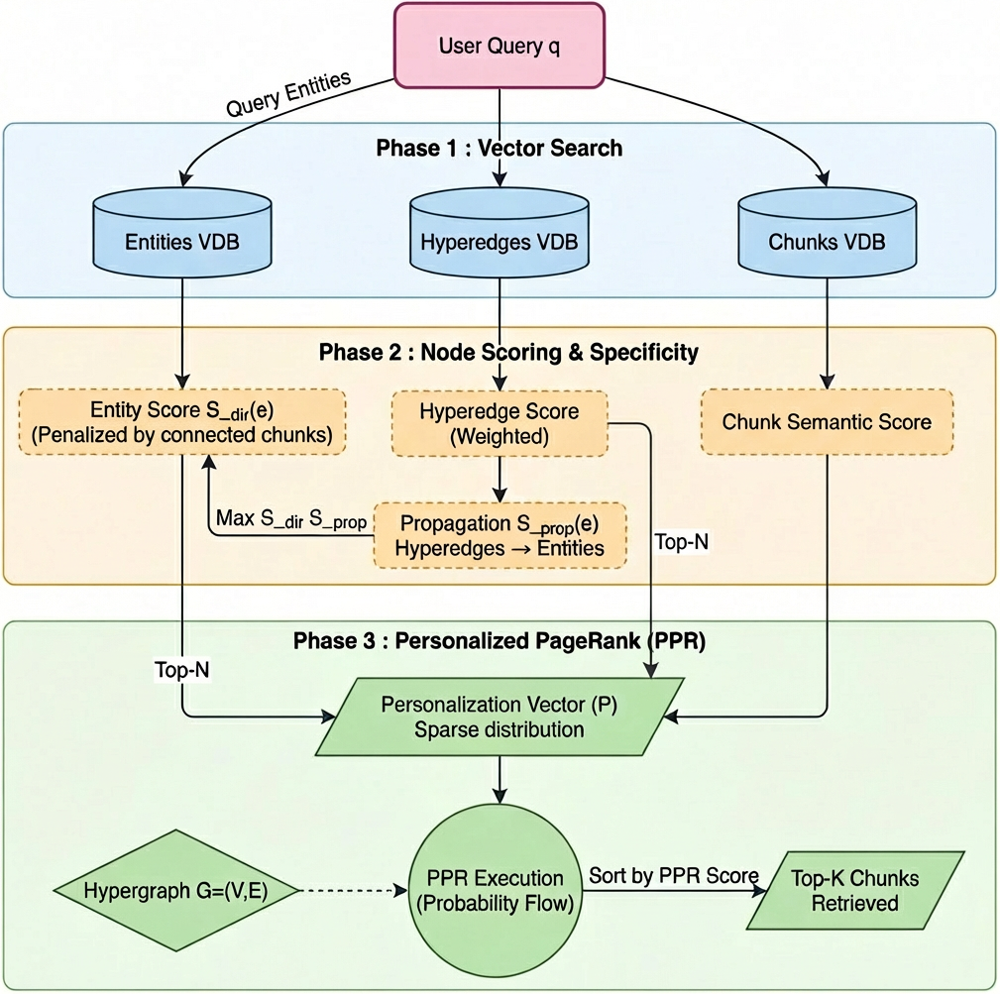

# HyperGraphRAG — Optimized Extraction & Retrieval

> **This repository is a fork of [HyperGraphRAG](https://github.com/LHRLAB/HyperGraphRAG)** (Luo et al., NeurIPS 2025) extended with two optimizations published at **APIA 2026**:
>
> **"Optimisation du RAG sur hypergraphes : vers une meilleure extraction de faits et récupération de chunks"**  
> Houda Khrouf, Pedro Fillastre, Sebastiao Correia — Applied Research, Qlik.

---

## Contributions

This work addresses two key limitations of the original HyperGraphRAG pipeline:

### 1. EXT⁺⁺ — Improved Hypergraph Extraction via Self-Consistency Prompting

LLM-based extraction of hypergraphs is prone to structural instabilities: missing entities, isolated hyperedges, and unresolved coreferences that fragment the graph topology. **EXT⁺⁺** integrates a *self-consistency prompting* mechanism (inspired by [Universal Self-Consistency](https://arxiv.org/abs/2311.17311)). Key benefits:

- **Reduces isolated hyperedges** (e.g., from 62% → 20% on Fiction).
- **Increases entity connectivity** (higher average degree), enabling better multi-hop reasoning.
- **Produces richer hyperedge descriptions** (+72% token length on MAUD).
- **No additional cost** — prefix caching and shorter completions make EXT⁺⁺ faster and cheaper than the baseline extraction.

### 2. Personalized PageRank (PPR) on the Hypergraph — Topology-Aware Chunk Retrieval

The original retrieval in HyperGraphRAG relies on semantic search + local one-hop expansion, under-exploiting the global graph topology. Inspired by [HippoRAG2](https://arxiv.org/abs/2502.14802), we integrate chunks directly as nodes in the hypergraph and apply **Personalized PageRank** over the resulting tripartite structure (entities – hyperedges – chunks). This yields significant gains in contextual recall (+51% on Fiction, +69% on MAUD) and completeness (+11%) compared to the original HyperGraphRAG.

---

## Overview
### HyperGraphRAG Pipeline


### PPR-retrieval Optimization

<p align="center">

</p>

## Environment Setup

```bash
conda create -n hypergraphrag python=3.11
conda activate hypergraphrag
pip install -r requirements.txt
```

## Quick Start

### Knowledge HyperGraph Construction

```python
import os
import json
from hypergraphrag import HyperGraphRAG
os.environ["OPENAI_API_KEY"] = "your_openai_api_key"

rag = HyperGraphRAG(working_dir=f"expr/example")

with open(f"example_contexts.json", mode="r") as f:
    unique_contexts = json.load(f)

rag.insert(unique_contexts)
```

### Knowledge HyperGraph Query

```python
import os
from hypergraphrag import HyperGraphRAG
os.environ["OPENAI_API_KEY"] = "your_openai_api_key"

rag = HyperGraphRAG(working_dir=f"expr/example")

query_text = 'How strong is the evidence supporting a systolic BP target of 120–129 mmHg in elderly or frail patients, considering potential risks like orthostatic hypotension, the balance between cardiovascular benefits and adverse effects, and the feasibility of implementation in diverse healthcare settings?'

result = rag.query(query_text)
print(result)
```

> For evaluation, please refer to the [evaluation](./evaluation/README.md) folder.

---

## References

If you use this work, please cite both the original HyperGraphRAG paper and our optimization paper:

```bibtex
@inproceedings{khrouf2026hypergraphrag-optim,
      title={Optimisation du RAG sur hypergraphes : vers une meilleure extraction de faits et récupération de chunks},
      author={Houda Khrouf and Pedro Fillastre and Sebastiao Correia},
      booktitle={Proceedings of the 12th Conference on Applications Pratiques de l’Intelligence Artificielle (APIA@PFIA 2026)},
      year={2026},
}

@misc{luo2025hypergraphrag,
      title={HyperGraphRAG: Retrieval-Augmented Generation via Hypergraph-Structured Knowledge Representation}, 
      author={Haoran Luo and Haihong E and Guanting Chen and Yandan Zheng and Xiaobao Wu and Yikai Guo and Qika Lin and Yu Feng and Zemin Kuang and Meina Song and Yifan Zhu and Luu Anh Tuan},
      year={2025},
      eprint={2503.21322},
      archivePrefix={arXiv},
      primaryClass={cs.AI},
      url={https://arxiv.org/abs/2503.21322}, 
}
```

---

## Acknowledgement

This repo is a fork of and benefits from [HyperGraphRAG](https://github.com/LHRLAB/HyperGraphRAG) (NeurIPS 2025). Our PPR-based retrieval is inspired by [HippoRAG2](https://arxiv.org/abs/2502.14802). We also acknowledge [LightRAG](https://github.com/HKUDS/LightRAG), [Text2NKG](https://github.com/LHRLAB/Text2NKG), and [HAHE](https://github.com/LHRLAB/HAHE).